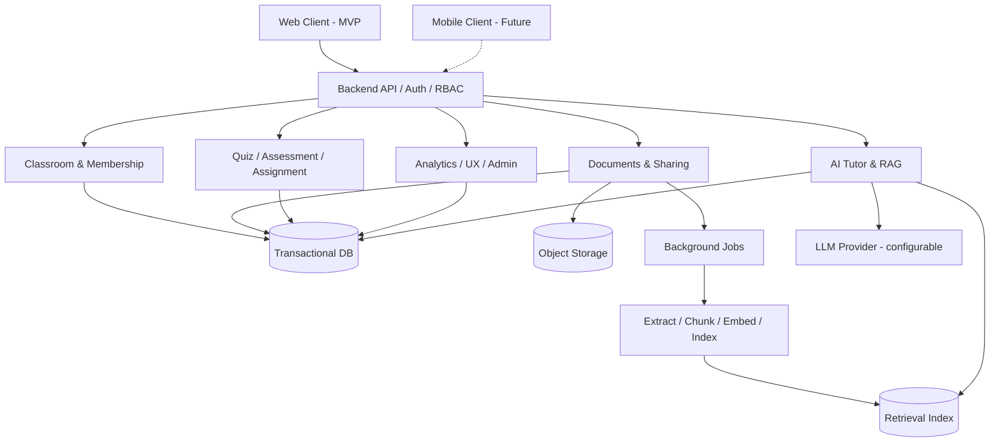

# RAG Course Assistant — Kiến trúc hệ thống

**Version:** 0.3.0-draft | **Updated:** 2026-10-10 | **Status:** Bản đề xuất để nhóm review.
**Nguồn nghiệp vụ:** [BUSINESS_RULES.md](BUSINESS_RULES.md), Baseline v1.0. **Kế hoạch:** [TASK_PLAN.md](../tasks/TASK_PLAN.md). **Quy trình Git:** [CONTRIBUTING.md](../CONTRIBUTING.md).

> Phân biệt **[BR]** quy tắc đã chốt, **[ĐỀ XUẤT]** phương án kỹ thuật chờ review, **[CHƯA CHỐT]** quyết định chưa đủ thông tin. Tài liệu không tự phê duyệt framework, database, model hay dịch vụ cloud.

## 1. Mục tiêu, phạm vi, stakeholder
RAG Course Assistant là hệ thống hỗ trợ nhiều môn và nhiều lớp độc lập, kết hợp Classroom, tài liệu, RAG AI Tutor, Practice Quiz, Assessment, Assignment, Analytics và Admin. Ba vai trò đăng nhập: Admin, Lecturer, Student; nhà trường nhận báo cáo qua Admin. Các nhu cầu ban đầu là giả thuyết sản phẩm, chưa được xác thực bằng khảo sát. [BR: A–G]

**MVP Web-first:** hoàn thiện ứng dụng Web trước. **Mobile-later:** khi Web ổn định và còn thời gian, Coding Agent có thể tạo ứng dụng Mobile tái sử dụng Backend/API, ưu tiên trải nghiệm Student; không cam kết feature parity hay Mobile là điều kiện hoàn thành MVP. [ĐỀ XUẤT]

## 2. Kiến trúc mục tiêu và nguyên tắc
**[ĐỀ XUẤT] Modular Monolith + asynchronous background jobs**: dễ triển khai cho nhóm 4 người, giữ ranh giới module rõ ràng, không cần microservices sớm. Tách UI khỏi business logic; Backend chịu trách nhiệm xác thực, authorization, chấm điểm, trạng thái và audit. Web/Mobile dùng chung API và dữ liệu.

**Bất biến xuyên suốt:** (i) quyền hiện tại áp dụng cho mọi thao tác; (ii) phiên bản Assessment/attempt bất biến; (iii) AI không quyết định điểm chính thức; (iv) analytics cần bằng chứng; (v) thao tác nhạy cảm phải truy vết. [BR: B7, H4, O3, D1–D8, J1–J5, F7]

## 3. Bounded contexts và quyền sở hữu
| Module | Trách nhiệm | Dữ liệu sở hữu | Ràng buộc |
|---|---|---|---|
| Identity & Access | tài khoản, role, session, RBAC | users, roles, sessions | F1, K2, F3 |
| Classroom | class, membership, ownership, feed/comments | courses, classes, memberships, posts | A1–A6, H1–H2, L1–L5, M2, M5 |
| Documents | owner library, file/version, processing, share | documents, versions, shares, jobs | B1–B7, H3, O1 |
| AI Tutor | class-scoped retrieval, citations, chat | conversations, messages, retrieval traces tối thiểu | C1–C6, H4–H5, K3 |
| Learning Activities | question bank, Quiz, Assessment, Assignment | questions, activity versions, attempts, submissions, grades | D0–D8, I1–I7, M3–M4, O3 |
| Analytics | student/lecturer views, topic evidence | projections, aggregates | E1–E6, J1–J5, O6 |
| Learning UX | calendar, notifications, notes/bookmarks | events, notifications, notes | G3–G5, H6, L3, L6, O2 |
| Administration | intervention, audit, privacy request, reports | audit logs, requests, report jobs | F1–F7, K1–K6, O7–O8 |

**Nguyên tắc tích hợp:** module khác truy cập qua service/API đã định nghĩa, không trực tiếp sửa bảng sở hữu của nhau; mọi query nhạy cảm phải kiểm tra actor, class và trạng thái quyền.

## 4. Dữ liệu và mô hình nhất quán
**[ĐỀ XUẤT]** Transactional relational DB quản lý trạng thái nghiệp vụ; object storage lưu tệp gốc và bản trích xuất; retrieval index lưu embedding và metadata. Chưa chốt PostgreSQL/SQLite, vector DB, ORM hoặc cloud.

Định danh quan trọng: user_id, course_id, class_id, membership_id, document_id, document_version_id, share_id, chunk_id, conversation_id, activity_id, activity_version_id, attempt_id, submission_id, grade_revision_id. Mọi bản ghi gắn owner/tenant scope phù hợp; khóa ngoại và uniqueness bảo vệ dữ liệu, ví dụ (class_id, user_id) membership.

**Document version:** uploaded → queued → processing → ready/failed; chỉ ready mới trở thành active searchable version. Khi bản mới failed, giữ ready cũ; khi share revoked, quyền hiện tại phải vô hiệu hóa ngay cả nếu index chưa kịp cập nhật. [B4–B7, H3]

**Assessment:** draft → published immutable version → assigned → attempt in_progress/submitted/expired → grading → published result; chỉnh đề sau published tạo version mới; attempt luôn trỏ version cụ thể. Điểm sửa lưu revision + reason + actor + timestamp. [I1–I7, M4, O3]

**Retention:** cấu hình theo loại dữ liệu, chưa tự đặt thời hạn. Tách xóa vật lý, ẩn danh, giữ hợp lệ; audit không chứa nội dung chat riêng tư theo mặc định. [K1–K6, O7]

## 5. API & contract
**[ĐỀ XUẤT]** HTTP JSON API có version (ví dụ `/api/v1`), hợp đồng OpenAPI, lỗi chuẩn hóa (code, message, correlation_id), pagination, idempotency cho nộp bài/submit và xử lý job. Chưa chốt REST vs các kỹ thuật realtime.

Nhóm endpoint logic: auth/users; courses/classes/memberships; documents/versions/shares/jobs; tutor/conversations/messages; questions/quizzes; assessments/attempts/grades/reviews; assignments/submissions; analytics; calendar/notifications/notes; admin/privacy/reports.

**Bắt buộc:** authorization ở Backend, không dựa vào việc UI ẩn nút; API chỉ trả dữ liệu được phép; deadline/time limit dùng thời gian server; trạng thái attempt và submit chịu được retry. [A1, B7, D6, I1–I2, K3, O4]

## 6. AI & RAG
Luồng: xác thực user + lớp → kiểm tra membership hiện tại và trạng thái lớp → xác định document shares hiện hành và phiên bản ready → truy hồi theo class/doc/version ACL → sinh câu trả lời có căn cứ → xác minh citation khớp chunk và quyền → trả lời; nếu thiếu chứng cứ, nói rõ và phân biệt kiến thức chung. [B7, C1–C5, H3–H5]

Index metadata tối thiểu: chunk_id, document_id, version_id, class/share scope nếu thích hợp, source locator (page/slide/section), processing status, embedding_version. **Không chỉ dựa vào filter metadata đã lưu**: kiểm tra quyền hiện tại trước khi đưa chunk vào prompt và trước khi mở nguồn; revoke phải có hiệu lực ngay.

Hai chế độ AI Tutor: quick Q&A và step-by-step. Chat gắn một lớp; giảng viên có custom instruction bị giới hạn bởi system policy. Lịch sử có thể giữ nhưng redaction nội dung nguồn mất quyền. [C4–C6, K3]

**Đánh giá RAG:** tập câu hỏi có nguồn kỳ vọng, kiểm tra retrieval relevance, citation correctness, groundedness, abstention, cross-class leakage, latency và chi phí. Không khẳng định chất lượng nếu chưa có benchmark.

## 7. Assessment & grading safety
Practice Quiz tách khỏi formal grades. Câu hỏi AI-generated phải qua lecturer approval; AI feedback không được quyết định điểm chính thức. Assessment tắt Tutor tích hợp trong lúc làm; không cam kết ngăn AI bên ngoài. [D1–D8]

Attempt lưu câu trả lời đã xác nhận; reconnect chỉ resume nếu còn giờ; timeout auto-submit saved answers; policy best/latest/average cấu hình từ khi tạo. Grade correction có lý do và lịch sử, analytics lấy điểm confirmed mới nhất. Xử lý late submission, resubmission, review và erroneous questions theo I, M, O. Tất cả hành động nhạy cảm có test tình huống cạnh tranh và idempotency.

## 8. Analytics và privacy
Analytics dựa trên bằng chứng độc lập, topic coverage và kết quả có trạng thái; khi không đủ, hiển thị **“Chưa đủ dữ liệu”**. Không coi chat lặp là bằng chứng mastery. Giảng viên chỉ xem tổng hợp chủ đề Tutor, không xem nguyên văn chat; nhóm dưới 5 sinh viên tham gia phân biệt bị ẩn, áp dụng complementary suppression. Cảnh báo at-risk tự động và learning path nâng cao thuộc Future. [E1–E6, J1–J5, O6]

User được xem dữ liệu cá nhân, gửi yêu cầu export/delete; Admin xác minh và xử lý thủ công trong MVP. Báo cáo trường là aggregate PDF/Excel. [F4, F6, K1–K6, O8]

## 9. Security, observability, operations
**[ĐỀ XUẤT]** session/token an toàn theo nền tảng; RBAC + object-level checks; secrets qua environment/secret manager; giới hạn kích thước/loại file, quét và sandbox xử lý tài liệu; rate limit AI; job retry có giới hạn và idempotency; audit tối thiểu với correlation IDs. Không ghi raw prompts, tài liệu riêng tư hay câu trả lời cá nhân vào log mặc định.

Các chỉ số: API errors/latency, job queue failures, document processing success, RAG citation failures, assessment submit/timeout anomalies, permission-denied events. Backup/restore và deployment environment phải được kiểm chứng trước demo.

## 10. Quality & verification
- Unit tests cho quyền, trạng thái, điểm, version, deadline.
- Integration tests cho upload→ready→share→retrieve; revoke→no retrieval; reconnect→timeout; grade revision→analytics; leave class→restricted result access.
- E2E smoke tests cho Student/Lecturer/Admin.
- Security tests: IDOR/cross-class access, unauthorized document link, leaked source snippets, private chat access.
- RAG evaluation dataset có grounded answers và negative cases.
- Mỗi thay đổi phải có test và minh chứng tương ứng; tích hợp sớm khi đã đủ điều kiện.

## 11. Chiến lược Web-first / Mobile-later
Web MVP triển khai trước. Backend/API phải độc lập UI để Mobile sử dụng lại auth, classes, documents, Tutor và dữ liệu học tập. **[ĐỀ XUẤT]** Mobile ưu tiên đăng nhập, lớp, tài liệu, AI Tutor, Practice Quiz, thông báo và dashboard; Assessment/Assignment mobile chỉ bổ sung khi kiểm chứng đầy đủ offline/reconnect, deadline, file submission. Framework mobile chưa chốt. Không tạo Tasks Mobile trước khi Web ổn định.

## 12. Quy trình cộng tác và tiến hóa kiến trúc
Cấu trúc module, hợp đồng API và các bất biến nghiệp vụ được bảo vệ bằng test; triển khai theo từng vertical slice, cập nhật tài liệu khi có quyết định thực tế. Không xây dựng hệ thống phân tán hoặc framework trừu tượng quá sớm chỉ vì dự đoán tải tương lai. Khi tăng tải, có thể mở rộng API stateless, background workers, object storage và retrieval index độc lập theo nhu cầu đã đo. Quy trình Git và Coding Agent xem [CONTRIBUTING.md](../CONTRIBUTING.md) và [AGENTS.md](../../AGENTS.md).

## 13. Quyết định chưa chốt
Framework frontend/backend/mobile; database/ORM/vector index; queue/object storage; LLM/embedding; auth/session strategy; deployment hosting; realtime notification; chi tiết retention duration; ngưỡng chất lượng RAG; CI command; tiêu chí chấm commit thực tế của giảng viên. Mọi lựa chọn phải có ADR và review.

## 14. Architecture Decision Record (ADR)
Mẫu: ID, bối cảnh, lựa chọn, phương án thay thế, trade-offs, rule liên quan, người duyệt, ngày, trạng thái, tác động Tasks. Các đề xuất Modular Monolith, REST/OpenAPI và asynchronous jobs **chưa phải ADR được duyệt**.

## 15. Quy tắc thay đổi
Thay đổi business rule → review BUSINESS_RULES → cập nhật Architecture → kiểm tra Task/acceptance/tests. Thay đổi contract/schema dùng chung → thông báo module owners, có migration/backward compatibility plan. Không merge thay đổi breaking khi consumer chưa được cập nhật.

## 16. Lịch sử
- **0.3.0-draft (2026-10-10):** bỏ kế hoạch theo tuần khỏi Architecture, nhấn mạnh thiết kế mở rộng theo nhu cầu, cập nhật liên kết thư mục phân loại.
- **0.2.0-draft (2026-10-10):** bản nháp kiến trúc tổng thể.
