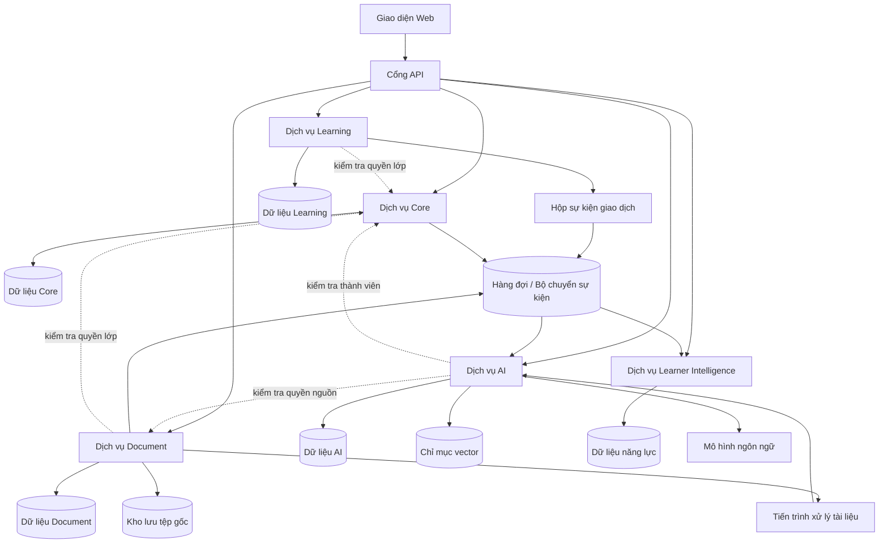

# RAG Course Assistant — Kiến trúc Microservices

**Phiên bản:** 1.0.0-draft | **Ngày:** 10/10/2026 | **Trạng thái:** Đề xuất, chờ nhóm duyệt.

**Định hướng:** Thiết kế hệ thống theo Microservices ngay từ đầu, không phải tài liệu chuyển đổi từ Monolith. **Nguồn nghiệp vụ có hiệu lực:** [Quy tắc nghiệp vụ](../BUSINESS_RULES.md). **Cơ sở lựa chọn:** [ADR-001](ADR-001.md). **Tiêu chí kiểm chứng:** [Thuộc tính chất lượng](QUALITY_ATTRIBUTES.md).

> [ĐÃ CHỐT] là quy tắc nghiệp vụ hoặc mức ưu tiên đã thống nhất; [ĐỀ XUẤT] là quyết định kỹ thuật chưa duyệt; [CHƯA CHỐT] là vấn đề cần thảo luận. Không tự suy diễn đã chọn công nghệ hoặc đã kiểm thử thành công.

## 1. Mục tiêu và phạm vi
RAG Course Assistant là nền tảng **ưu tiên học tập thông minh**: trung tâm tri thức môn học, trợ giảng AI có trích dẫn, luyện tập, đánh giá chính thức, mô hình năng lực người học và gợi ý học tập cá nhân hóa. Chức năng quản lý lớp học hỗ trợ các mục tiêu này. Có ba vai trò đăng nhập: Quản trị viên, Giảng viên, Sinh viên. Một môn có thể có nhiều lớp; sinh viên có thể học nhiều lớp. Ưu tiên ứng dụng Web; Mobile chỉ xem xét sau khi Web ổn định. [A, C, D, E, G, O]

## 2. Các dịch vụ nghiệp vụ
| Dịch vụ | Phạm vi nghiệp vụ | Dữ liệu sở hữu |
|---|---|---|
| **Core** (Nền tảng lõi) | Tài khoản, vai trò, lớp, thành viên, duyệt vào lớp, đồng giảng viên, bảng tin, thông báo, điều phối quản trị | Người dùng, lớp, quyền thành viên, phiên đăng nhập, sự kiện quản trị lõi |
| **Document** (Tài liệu) | Thư viện cá nhân giảng viên, tệp gốc, phiên bản, chia sẻ, quyền truy cập, xem/tải, trạng thái xử lý | Tài liệu, phiên bản, quyền chia sẻ, tệp gốc, tác vụ xử lý |
| **Learning** (Hoạt động học tập) | Ngân hàng câu hỏi, luyện tập, bài đánh giá, bài tập, lượt làm, bài nộp, điểm, phúc khảo | Đề và phiên bản, câu trả lời, lượt làm, điểm và lịch sử sửa điểm |
| **AI** (Trợ giảng thông minh) | RAG, truy hồi, hội thoại, trích dẫn, nhúng và chỉ mục tìm kiếm | Hội thoại, dữ liệu truy hồi dẫn xuất, phiên bản nhúng/chỉ mục |
| **Learner Intelligence** (Phân tích người học) | Bằng chứng học tập, mức độ nắm vững chủ đề, gợi ý, thống kê | Hồ sơ năng lực, dữ liệu tổng hợp, gợi ý và dấu vết bằng chứng |

Đây là **5 ranh giới nghiệp vụ đề xuất**, không có nghĩa mọi chức năng phải chạy trên 5 máy vật lý riêng. Tác vụ nền có thể có nhiều tiến trình trong phạm vi dịch vụ sở hữu.

## 3. Nguyên tắc thiết kế
1. Mỗi dịch vụ có hợp đồng giao tiếp và quyền sở hữu dữ liệu riêng; không đọc/ghi trực tiếp bảng của dịch vụ khác.
2. Bài nộp, điểm chính thức và lịch sử sửa điểm nhất quán trong giao dịch của Learning; phân tích năng lực được cập nhật bất đồng bộ.
3. AI không quyết định điểm chính thức. Câu hỏi do AI sinh phải được giảng viên duyệt; tắt trợ giảng tích hợp trong kỳ đánh giá chính thức. [D1, D4–D6]
4. Quyền truy cập hiện tại được ưu tiên; phải kiểm tra quyền trước khi đưa đoạn tài liệu vào ngữ cảnh mô hình và trước khi mở nguồn trích dẫn. Nếu không xác minh được quyền thì từ chối thao tác nhạy cảm. [B6–B7, H4, K3]
5. AI hỏng không được làm hỏng các chức năng không phụ thuộc AI; không cam kết chịu được sự cố hạ tầng chung nếu chưa có cơ chế tương ứng.
6. Có giới hạn thời gian chờ, tài nguyên, cơ chế thử lại an toàn, quan sát hệ thống và kiểm thử hợp đồng.
7. Giao diện Web và các dịch vụ Backend giao tiếp qua API có phiên bản.

## 4. Sơ đồ kiến trúc

Các phụ thuộc kiểm tra quyền là đường xử lý nhạy cảm: khi nguồn xác minh không khả dụng, hệ thống từ chối thay vì sử dụng quyền cũ một cách thiếu kiểm soát.

## 5. Dữ liệu và tính nhất quán
- Mỗi dịch vụ sở hữu một cơ sở dữ liệu hoặc vùng dữ liệu riêng và tài khoản truy cập riêng. **Có thể dùng chung một máy chủ PostgreSQL**, nhưng không chia sẻ bảng hay khóa ngoại xuyên dịch vụ. Loại cơ sở dữ liệu cuối cùng vẫn [CHƯA CHỐT].
- Tệp gốc và quyền chia sẻ do Document quản lý. AI chỉ sở hữu dữ liệu dẫn xuất để truy hồi; metadata trong chỉ mục vector **không phải nguồn xác thực quyền**.
- Giao tiếp bất đồng bộ dùng cơ chế **Transactional Outbox (hộp sự kiện cùng giao dịch)**, phát sự kiện ít nhất một lần và **Idempotent Consumer (bộ nhận xử lý lặp an toàn)**.
- Sự kiện phải có mã định danh, phiên bản cấu trúc, thời điểm, nguồn phát, đối tượng, phiên bản đối tượng và mã truy vết. Không phát tán nội dung hội thoại riêng tư hay nguyên văn tài liệu trong sự kiện chung.
- Có hàng đợi lỗi, xử lý lại, đối soát và chống sự kiện đến sai thứ tự. Không tuyên bố toàn hệ thống có bảo đảm phát sự kiện đúng một lần tuyệt đối.
- Các mã định danh quan trọng: `user_id`, `class_id`, `document_id`, `document_version_id`, `activity_version_id`, `attempt_id`, `grade_revision_id`, `event_id`, `correlation_id`.

## 6. Các luồng nghiệp vụ trọng tâm
### 6.1. Tải tài liệu và lập chỉ mục
1. Giảng viên tải tệp lên; Document xác minh quyền, kiểm tra định dạng và lưu tệp gốc cùng phiên bản bất biến.
2. Document tạo tác vụ; tiến trình nền trích xuất, chuẩn hóa, chia đoạn và tạo biểu diễn nhúng.
3. AI lập **bản chỉ mục ứng viên** tách biệt, kiểm tra hoàn chỉnh và phản hồi kết quả.
4. Chỉ công bố phiên bản đã xử lý thành công; phiên bản mới lỗi không thay thế phiên bản hợp lệ trước đó.
5. Thu hồi chia sẻ có hiệu lực tại bước xác minh quyền, không phải chờ xóa vector. [B4–B7, H3]

[CHƯA CHỐT] Giao thức xác nhận và chuyển đổi nguyên tử giữa bản chỉ mục ứng viên và bản đang hoạt động.

### 6.2. Hỏi trợ giảng AI
1. Xác thực người dùng, lớp đang chọn và quyền thành viên hiện tại.
2. Xác định tài liệu và phiên bản hợp lệ, truy hồi các đoạn ứng viên.
3. **Xác minh lại quyền từng nguồn trước khi đưa nội dung vào lời nhắc của mô hình**; loại bỏ nguồn không được phép.
4. Sinh câu trả lời có căn cứ, phân biệt kiến thức chung, kiểm tra trích dẫn và nói rõ khi thiếu bằng chứng.
5. Kiểm tra quyền khi mở nguồn; lịch sử hội thoại phải che nội dung mất quyền. Lớp đã lưu trữ không được hỏi mới. [C1–C6, H4–H5, K3]

### 6.3. Nộp bài, chấm và sửa điểm
1. Learning xác minh quyền, phiên bản đề bất biến, thời hạn theo đồng hồ máy chủ; lưu câu trả lời đã xác nhận.
2. Nộp bài kèm khóa chống lặp; một giao dịch ghi trạng thái bài nộp và sự kiện trong hộp sự kiện.
3. Trả xác nhận mà **không chờ AI hoặc Learner Intelligence**; hết giờ tự nộp các câu đã lưu, mất mạng chỉ tiếp tục nếu còn thời gian. [I1–I4, O3]
4. Câu khách quan chấm theo quy tắc; giảng viên duyệt điểm chủ quan/bài tập. Sửa điểm ghi người sửa, lý do, thời gian và phiên bản. [D4–D5, I6]
5. Learner Intelligence nhận sự kiện kết quả đã xác nhận; xử lý lặp và sai thứ tự theo phiên bản mới nhất. [J3]

### 6.4. Phân tích năng lực và gợi ý
- Bằng chứng gắn chủ đề/mục tiêu học tập đã được giảng viên xác nhận. Không coi hỏi lặp là bằng chứng năng lực độc lập.
- Khi dữ liệu thiếu, hiển thị **“Chưa đủ dữ liệu”**; gợi ý chỉ hỗ trợ, sinh viên tự quyết định. [E3–E6, J1–J5]
- Thống kê chủ đề hội thoại AI phải ẩn nhóm có dưới 5 sinh viên tham gia phân biệt và áp dụng ẩn bổ sung. [O6]

## 7. Hợp đồng giao tiếp
- [ĐỀ XUẤT] API HTTP/JSON có phiên bản, mô tả OpenAPI, mã lỗi thống nhất, phân trang và mã truy vết.
- Giao tiếp đồng bộ chỉ khi cần phản hồi hoặc xác minh quyền; tác vụ nặng, lập chỉ mục và cập nhật phân tích dùng hàng đợi.
- Các sự kiện dự kiến: `MembershipRevoked`, `DocumentVersionReady`, `DocumentAccessRevoked`, `AssessmentSubmitted`, `AssessmentGraded`, `GradeRevised`, `PracticeCompleted`.
- Sự kiện thu hồi quyền hỗ trợ lan truyền thay đổi, **không thay thế kiểm tra quyền hiện hành**.
- Mọi dịch vụ phải có xác thực nội bộ, giới hạn thời gian chờ, kiểm thử tương thích API và chính sách thử lại phù hợp.

## 8. Bảo mật, quyền riêng tư và vận hành
Phân quyền theo vai trò và tài nguyên; ngăn truy cập chéo lớp; giới hạn tệp tải lên, xử lý tệp không tin cậy, bảo vệ bí mật và đường truyền, kiểm soát đường dẫn tải xuống, giới hạn truy vấn AI. Giảng viên và Admin không mặc định đọc hội thoại riêng tư. Yêu cầu xóa dữ liệu phải phân loại xóa/ẩn danh/giữ hợp lệ; thời hạn lưu giữ cụ thể cần phê duyệt. Nhật ký không mặc định lưu lời nhắc hay tài liệu nguyên văn. [F3–F7, K1–K6, O7–O8]

## 9. Triển khai và quan sát
[ĐỀ XUẤT] GitHub Actions kiểm thử và đóng gói từng dịch vụ; Docker để triển khai; Docker Compose cho môi trường ban đầu. Có kiểm thử đơn vị, tích hợp, hợp đồng, bảo mật và kiểm thử nhanh sau triển khai. Mỗi dịch vụ có ảnh đóng gói, kiểm tra sức khỏe và quy trình thay đổi cấu trúc dữ liệu riêng. Cần kế hoạch quay về phiên bản ứng dụng cũ và thay đổi cơ sở dữ liệu tương thích ngược. Docker Compose không tự bảo đảm tính sẵn sàng cao hay triển khai không gián đoạn.

Theo dõi tỷ lệ lỗi, p95, độ trễ hàng đợi, số tác vụ lỗi, xung đột nộp bài, từ chối truy cập, trích dẫn RAG, nhật ký có mã truy vết. Kiểm chứng sao lưu và phục hồi trước demo.

## 10. Thuộc tính chất lượng
Tham chiếu [QUALITY_ATTRIBUTES.md](QUALITY_ATTRIBUTES.md). **P0:** Availability (sẵn sàng), Fault Isolation (cô lập lỗi), Data Integrity (toàn vẹn dữ liệu), Security & Privacy (bảo mật và riêng tư), Performance (hiệu năng), RAG Quality (chất lượng RAG). **P1:** Scalability (mở rộng), Deployability (triển khai độc lập), Modifiability (dễ thay đổi), Recoverability (phục hồi), Recommendation Quality (chất lượng gợi ý). Ngưỡng đo là mục tiêu dự kiến, chưa phải kết quả đạt được.

## 11. Rủi ro và vấn đề chưa chốt
- Đánh đổi giữa tính sẵn sàng và xác minh quyền: ưu tiên bảo mật, từ chối khi không xác minh được quyền.
- Cơ chế kích hoạt chỉ mục tài liệu, thu hồi quyền trong lúc AI đang sinh câu trả lời.
- Core là phụ thuộc quan trọng; cần giảm chuỗi gọi đồng bộ và xử lý sự cố quyền.
- Chi phí vận hành hàng đợi, sự kiện, nhật ký và các dịch vụ độc lập cho nhóm 4 người.
- Công nghệ cụ thể, môi trường triển khai, mục tiêu phục hồi RPO/RTO, thời hạn lưu dữ liệu.
- Chủ sở hữu chuẩn của mục tiêu học tập, ánh xạ câu hỏi sang chủ đề và các tác vụ quản trị xuyên dịch vụ.

**Trạng thái cuối:** kiến trúc Microservices-first ở mức đề xuất, chưa triển khai hoặc kiểm thử thực tế.
